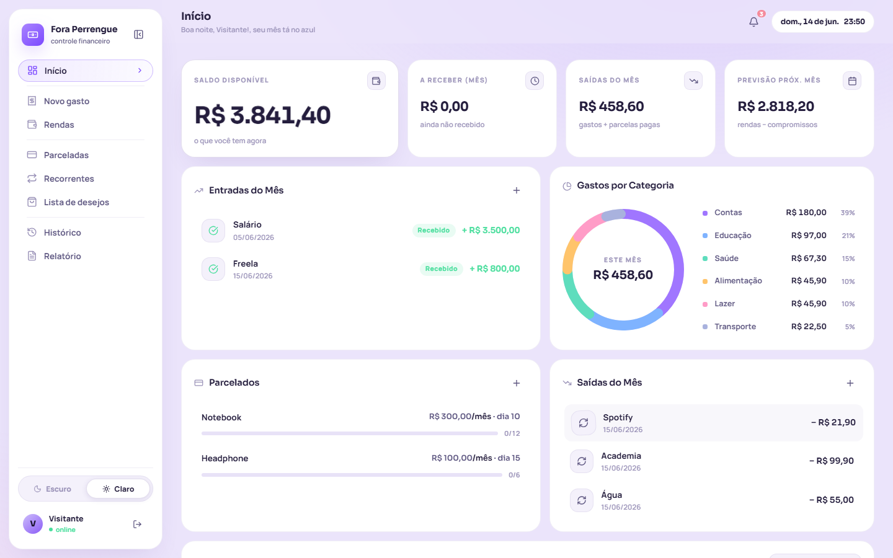
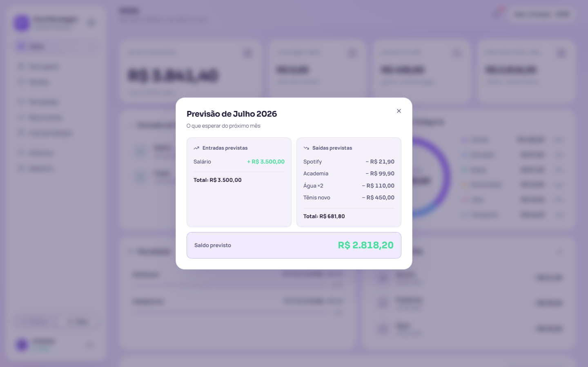
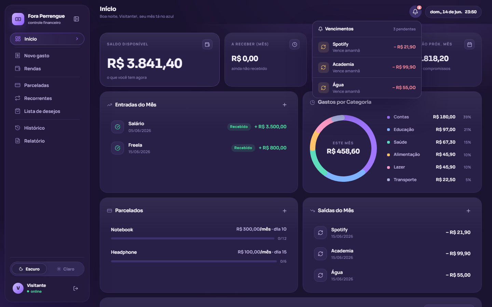
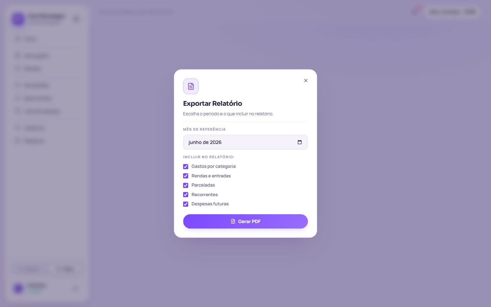
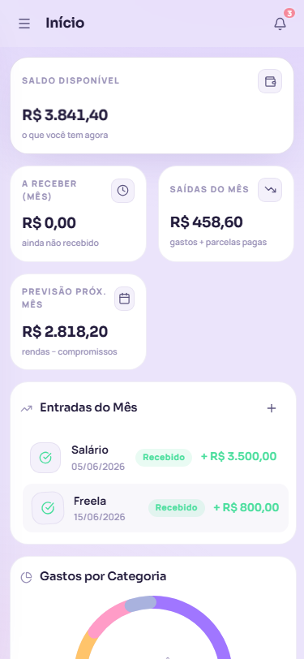

  

  

  

 

## Demo

  

 

## Visão Geral

O Fora Perrengue começou como trabalho de faculdade com uma restrição simples: construir um site usando apenas HTML, CSS e JavaScript puro. Poderia ter ficado em uma landing page qualquer, mas foi crescendo até virar um app de controle financeiro pessoal real, que uso no dia a dia.

A proposta é direta: você registra seus gastos, rendas, parcelamentos e contas fixas num lugar só. O app calcula o saldo em tempo real, mostra como você está distribuindo os gastos por categoria e ainda te antecipa o que esperar do próximo mês antes que ele chegue.

Feito pra quem quer se achar financeiramente sem depender de planilha ou bloco de notas.

 

## Tecnologias

  

  
  &nbsp;
  
  &nbsp;
  

 

## Funcionalidades

<strong>Dashboard</strong>

 

Tela principal com visão geral do mês. Exibe quatro cards no topo: saldo disponível, a receber no mês, saídas do mês e previsão do próximo mês. Esse último é clicável e abre um modal com o detalhamento de entradas e saídas previstas para o mês seguinte.

Abaixo dos cards: lista de entradas do mês, gráfico de pizza com os gastos por categoria (clicável por fatia), parcelamentos em andamento com progresso individual, recorrentes do mês e um gráfico de barras comparativo com histórico de até 12 meses.

<strong>Gastos</strong>

 

Registro de gastos com nome, valor, categoria e data. Categorias disponíveis: Alimentação, Transporte, Lazer, Contas, Saúde, Educação, Beleza, Outros e Cartão de Crédito.

Gastos no cartão funcionam de forma diferente: o valor não sai do saldo atual. Ele entra como saída no próximo mês, no dia do vencimento da fatura. Esse dia é configurado na primeira compra no cartão e fica salvo para as seguintes.

<strong>Rendas</strong>

 

Dois tipos de entrada para cobrir situações diferentes:

- **Avulsa:** valor que entrou uma única vez em um dia específico (freelance, venda, etc).
- **Regular:** renda que cai todo mês no mesmo dia, com opção de prazo determinado ou indeterminado (salário, aluguel, etc).

<strong>Parceladas</strong>

 

Cadastro de compras divididas. Você pode informar o valor total e o app divide automaticamente, ou informar direto o valor de cada parcela. Além disso, informe o número de parcelas, o mês da primeira e o dia de vencimento. Cada parcela pode ser marcada como paga conforme você for quitando.

<strong>Recorrentes</strong>

 

Pagamentos que se repetem com frequência: mensal, quinzenal ou semanal. Cada um tem um botão "Pagar" que registra o gasto e já agenda o próximo vencimento automaticamente. É possível desfazer o último pagamento se precisar corrigir alguma coisa.

<strong>Lista de Desejos</strong>

 

Planejamento de compras futuras com nome, valor estimado, data pretendida e uma observação opcional. Os itens já entram no cálculo de previsão do próximo mês exibido no Dashboard.

<strong>Histórico</strong>

 

Listagem completa de todos os gastos com filtro por categoria. Exibe também os valores recebidos, separados dos gastos. Tem opção de limpar tudo caso precise zerar o histórico.

<strong>Relatório PDF</strong>

 

Gera um PDF com os dados do mês escolhido. Você seleciona o que incluir: gastos por categoria, rendas, parceladas, recorrentes e despesas futuras. O arquivo é baixado direto pelo navegador.

<strong>Perfil</strong>

 

Edição do nome de exibição, upload de foto de perfil (salva no Supabase Storage) e alteração de senha. Exibe também a data de criação da conta.

<strong>Notificações</strong>

 

Sino no topo da tela com badge numérico. Mostra parcelas, recorrentes e fatura do cartão que vencem nos próximos 7 dias. Itens com vencimento em até 2 dias aparecem marcados como urgentes.

<strong>Onboarding</strong>

 

Tutorial de 8 slides exibido automaticamente no primeiro acesso. Apresenta cada área do app antes de o usuário começar a registrar qualquer coisa.

 

## Screenshots

<table>
  <tr>
    <td align="center" width="50%">
      
       Dashboard
    </td>
    <td align="center" width="50%">
      
       Previsão do próximo mês
    </td>
  </tr>
  <tr>
    <td align="center" width="50%">
      
       Notificações de vencimento
    </td>
    <td align="center" width="50%">
      
       Relatório PDF
    </td>
  </tr>
</table>

  
   Layout mobile

 

## Arquitetura

SPA sem bundler: três arquivos estáticos (`index.html`, `script.js`, `style.css`) servidos direto pelo Vercel. Toda a navegação acontece por troca de classes no DOM, sem roteamento de URL.

O acesso a dados passa por um objeto central chamado `DB`, que funciona como camada de abstração. Em modo autenticado, cada operação vai ao Supabase. Em modo visitante, os dados ficam em memória e somem ao recarregar a página.

As credenciais do Supabase não ficam expostas no código: são recuperadas em tempo de execução via uma serverless function (`/api/config`), que lê as variáveis de ambiente configuradas no painel do Vercel.

**Banco de dados (Supabase / PostgreSQL)**

| Tabela | Conteúdo |
|---|---|
| `perfis` | nome, username, e-mail, URL do avatar |
| `users` | preferências do usuário (tema, dia de vencimento do cartão) |
| `gastos` | gastos avulsos e de cartão |
| `rendas` | entradas avulsas e regulares |
| `parceladas` | compras parceladas com array de parcelas |
| `futuras` | despesas planejadas para o futuro |
| `recorrentes` | pagamentos recorrentes |

 

## Autor

  
  &nbsp;&nbsp;
  
  &nbsp;&nbsp;
  

 

  

